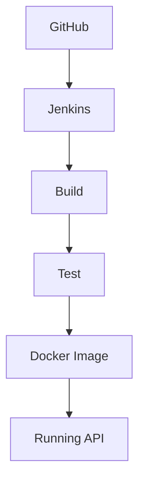

# Video Game Character API

This repository contains a compact ASP.NET Core Web API for managing video game characters. It demonstrates a layered architecture (Controllers ? Services ? Data), Entity Framework Core usage, unit and integration testing, Docker containerization, and a Jenkins-based CI/CD pipeline.

## Original project documentation (restored)

The original documentation is preserved below. It explains project layout, the API surface and basic usage.

### Project structure

- `Controllers/` - Receives HTTP requests and returns responses. It calls service methods to perform work.
- `Services/` - Contains business logic. Talks to the database via `AppDbContext` and translates between domain models and DTOs.
- `Data/` - Contains `AppDbContext` which is the EF Core database context. It defines which entities are stored in the database.
- `Models/` - Domain models that represent database tables (e.g., `Character`).
- `Dtos/` - Simple objects used to transfer data in/out of the API. Keeps domain models separate from API shape.
- `Program.cs` - App startup. Registers services and configures middleware.

### How the API works

1. Controllers define endpoints such as `GET /api/GameCharacter` and `POST /api/GameCharacter`.
2. Controllers call the service layer (for example `IVideoGameCharacterService`).
3. Services use `AppDbContext` to access the database and perform CRUD operations.
4. DTOs (`CreateCharacterRequest`, `UpdateCharacterRequest`, `CharacterResponse`) are used to avoid exposing EF entities directly to clients.

### Key files

- `Program.cs` - Application entry point and service registration.
- `AppDbContext.cs` - EF Core `DbContext` that exposes `DbSet<Character>`.
- `Character.cs` - Domain model representing a character record.
- `Dtos/` - DTOs used for request/response payloads.
- `IVideoGameCharacterService.cs` - Service interface.
- `VideoGameCharacterService.cs` - Service implementation.
- `GameCharacterController.cs` - HTTP controller for character endpoints.

### Running the project

- Ensure you have a SQL Server instance and update `appsettings.json` connection string `DefaultConnection`.
- Apply EF Core migrations (if not using containerized DB):

```bash
dotnet ef database update --project VideoGameCharacterApi
```

- Run the project in Visual Studio or via CLI.

### Example HTTP requests

- `GET /api/GameCharacter` - list all characters
- `GET /api/GameCharacter/1` - get character with id 1
- `POST /api/GameCharacter` - create new character (JSON: `Name`, `Game`, `Role`)
- `PUT /api/GameCharacter/1` - update character with id 1 (JSON: `Id`, `Name`, `Game`, `Role`)
- `DELETE /api/GameCharacter/1` - delete character with id 1

### Notes for beginners

- DTO: Data Transfer Object. Used to separate API shape from database entities.
- DbContext: Represents the database session; `DbSet<T>` collections represent tables.
- Migrations: EF Core feature to create/update database schema from code.

## Practical run and test instructions (added)

### Quick Start (Recommended)

Start the application stack using Docker Compose (from repository root):

```bash
docker-compose up --build
```

Then open the API documentation in a browser:

```
http://localhost:8080/swagger/index.html
```

This runs the API in a containerized environment.

### Run with Docker

Build the Docker image:

```bash
docker build -t gamecharacterapi .
```

Run the container:

```bash
docker run -p 8080:8080 gamecharacterapi
```

Access the Swagger UI at `http://localhost:8080/swagger/index.html`.

### Run Locally (.NET)

Restore, build and run the API locally:

```bash
dotnet restore
dotnet build
dotnet run --project VideoGameCharacterApi
```

Expected output: console will indicate the application URL and listening port. Use the Swagger URL above to explore endpoints.

### Running Tests

Run unit and integration tests:

```bash
dotnet test
```

This executes the test project and reports results.

### CI/CD Pipeline (Jenkins)

High-level pipeline steps:

1. Code pushed to GitHub.
2. Jenkins pulls the repository.
3. Pipeline stages run:
   - Restore
   - Build
   - Test
   - Publish
   - Docker Build
   - Push (optional)

Trigger builds manually from the Jenkins UI or configure a GitHub webhook to trigger on push.

The `Jenkinsfile` in the repository root implements the declarative pipeline.

### How to Verify CI/CD

Success criteria:

- Jenkins pipeline completes all stages without errors.
- No build or test failures are reported.
- Docker image is created (check local `docker images` or configured registry).

To verify:

1. Start a Jenkins job and monitor the stages.
2. Confirm tests pass in the Test stage.
3. Confirm Docker image is produced in the Docker Build stage.

### Execution Flow



### For Non-Technical Users

- The project exposes a web API documented by Swagger.
- Open the Swagger URL in a browser and use "Try it out" to exercise endpoints.

## DevOps artifacts added

- `Dockerfile` - multi-stage build for production runtime
- `docker-compose.yml` - minimal compose for running the API
- `docker-compose.db.yml` - compose with SQL Server for local development
- `Jenkinsfile` - declarative pipeline for Jenkins
- `VideoGameCharacterApi.Tests/` - unit and integration tests
- `docs/` - diagrams and setup guides

## Notes

- Ensure Docker daemon is running before using `docker` or `docker-compose` commands.
- Update the SQL Server connection string if you run the `docker-compose.db.yml` variant.

