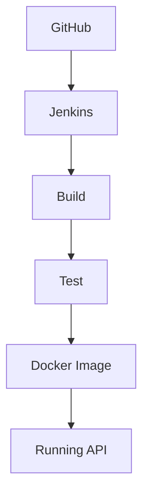

# Video Game Character API

Project
- Video Game Character API — a backend Web API to manage video game characters. Tech: .NET 8, ASP.NET Core, EF Core, Docker, Jenkins CI/CD.

Overview
- Small REST API that provides CRUD operations for video game characters. Demonstrates layered design (Controllers ? Services ? Data), automated tests, Docker containerization, and a Jenkins CI/CD pipeline.

## Quick Start (Recommended)

Run the application stack with Docker Compose (from repository root):

```bash
docker-compose up --build
```

When services are running, open the API documentation:

```
http://localhost:8080/swagger/index.html
```

This runs the API in a containerized environment.

## Run with Docker

Build the Docker image:

```bash
docker build -t gamecharacterapi .
```

Run the container:

```bash
docker run -p 8080:8080 gamecharacterapi
```

Access:

```
http://localhost:8080/swagger/index.html
```

## Run Locally (.NET)

Restore dependencies, build, and run the API locally:

```bash
dotnet restore
dotnet build
dotnet run --project VideoGameCharacterApi
```

Expected output: the console shows that the application started and the URL where it is listening. Open:

```
http://localhost:8080/swagger/index.html
```

## Running Tests

Run unit and integration tests:

```bash
dotnet test
```

This executes the test project and reports results for unit and integration tests.

## CI/CD Pipeline (Jenkins)

Pipeline overview:

1. Code pushed to GitHub
2. Jenkins pulls the repository
3. Pipeline stages:
   - Restore
   - Build
   - Test
   - Publish
   - Docker Build
   - Push (optional)

Triggering a build:

- Manual: Start a job from the Jenkins UI and select your branch.
- Automatic: Configure a GitHub webhook to notify Jenkins on push events.

The provided `Jenkinsfile` implements the declarative pipeline with the stages above.

## How to Verify CI/CD

Success criteria:

- Jenkins pipeline completes all stages without errors
- No build or test failures reported in pipeline logs
- Docker image is built (check Docker registry or local image list)

To verify manually:

1. Open Jenkins job and run the pipeline.
2. Observe each stage (Restore, Build, Test, Docker Build) completes successfully.
3. Confirm the Docker image appears in local images (`docker images`) or in the configured registry.

## Execution Flow



## For Non-Technical Users

- The project exposes an API documented via Swagger.
- Open the Swagger URL in a browser and use the "Try it out" button to call endpoints.
- The API supports listing, creating, updating and deleting characters.

## Project structure (summary)

- `VideoGameCharacterApi/` - Main API project
  - `Controllers/` - HTTP controllers
  - `Services/` - Business logic
  - `Data/` - EF Core DbContext
  - `Dtos/` - Request/response DTOs
  - `Models/` - Domain entities
- `VideoGameCharacterApi.Tests/` - Test project (unit and integration tests)
- `Dockerfile`, `docker-compose.yml`, `Jenkinsfile` - DevOps artifacts
- `docs/` - Additional documentation and diagrams

## Notes

- Ensure Docker daemon is running before using Docker or docker-compose commands.
- For local runs the application listens on the configured port; if 8080 is used by other services, adjust port mappings accordingly.

If you need a docker-compose variant that includes a SQL Server instance for local development, I can add it.
